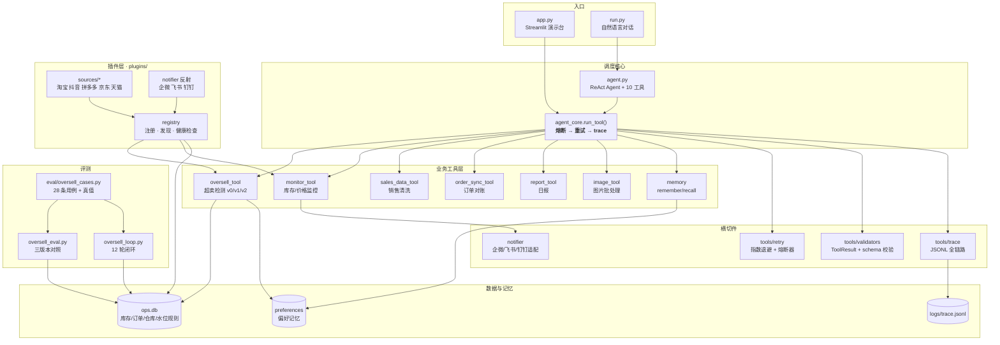
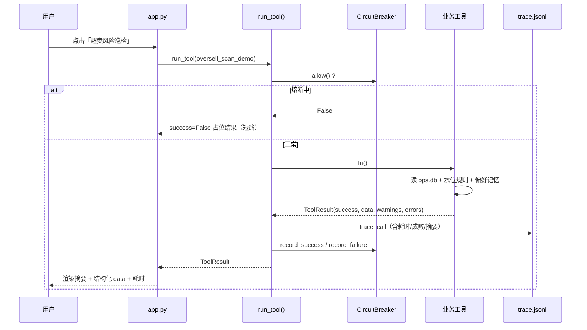

# ARCHITECTURE.md

本文档是**代码地图**：只描述相对稳定的系统边界、目录职责、核心运行链路和架构不变量。

---

## 一句话定位

一个**电商运营自动化 Agent**：用自然语言调度 10 个业务工具，把日常运营的脏活自动化。
核心业务能力是**多平台超卖防控** —— 用「可用库存 = 仓库 − 在途占用 − 安全库存」
判断各平台展示库存是否超标，并把人工确认的业务水位**沉淀成规则**，让人工介入率持续下降。

---

## 鸟瞰

---

## 核心运行链路

### A. 演示路径（Streamlit）

### B. Agent 路径（自然语言）

---

## 目录职责

| 路径 | 职责 |
|---|---|
| `app.py` | Streamlit 演示台：单工具 / 一键全流程 / 结构化结果 / Trace 面板 |
| `run.py` | 自然语言对话入口（`python run.py`） |
| `agent.py` | **Agent 定义**：10 个工具的注册 + `SYSTEM_PROMPT` + `chat()` |
| `agent_core.py` | **调度中间件**：`run_tool()` = 熔断 → 执行 → trace → 记成败 |
| `store.py` | **数据层（单一事实来源）**：SQLite 表结构与访问函数 |
| `memory.py` | **偏好记忆**：作用域 + 来源门控 + 白名单 |
| `notifier.py` | 通知适配器：企微 / 飞书 / 钉钉，未配置时降级为本地日志 |
| `config.py` | 配置（含 `DATA_DIR`、各 webhook、API Key） |
| `plugins/` | **插件层**：`registry`（注册/发现/健康检查）+ `sources/`（平台数据源，加平台 = 加一个文件） | 不依赖 `tools`（避免循环导入） |
| `tools/` | 业务工具 + 横切件（retry / validators / trace / platform_sync） |
| `eval/` | 评测：用例、三版本对照、闭合回路仿真 |
| `tests/` | 单元测试 |
| `docs/` | 机制文档与优化日志 |
| `data/` | `ops.db`、`alerts.log`（运行时产物，已 gitignore） |
| `logs/` | `trace.jsonl`（已 gitignore） |

---

## 架构不变量

1. **所有工具调用必须走 `run_tool()`。**
   绕过它 = 失去熔断、trace、成败记录。业务工具只关心自己的纯逻辑。

2. **所有工具必须返回 `ToolResult`，不能返回裸字符串。**
   字符串让 Agent 无法区分「成功但有空值」和「失败」；
   也导致「部分失败只能整段失败」。

3. **「在途占用」只算 `STOCK_OCCUPYING_STATUSES`（`paid` / `shipped`）。**
   取消、退款的订单不占库存。改这个常量会直接改变超卖判定结果。

4. **可用库存公式固定为 `仓库 − 在途占用 − 安全库存`。**
   `check_oversell_naive`（v0）刻意**不遵守**这条 —— 它是评测用的对照组，
   不是可用实现。任何人不得把 v0 当作生产路径。

5. **真值必须在造用例时写死。**
   `eval/oversell_cases.py` 的 `ground_truth` 是人工标注的。
   用模型标注真值 = 用模型评模型 = 评测失去意义。

6. **水位规则只能来自「人工确认」，不能由系统自己推断写入。**
   一次误判会被永久固化成业务事实。

7. **偏好记忆读取默认只认 `user_confirmed`。**
   `recall(..., allow_inferred=False)` 是默认值，不要随手改成 `True`。

8. **未配置凭证时必须降级为本地演示，不能报错。**
   这是「零凭证可运行」的前提，也是能给别人直接跑的前提。

9. **插件不可用时必须隔离，且绝不能把「不可用」写成 0。**
   `StockSnapshot` 的三态（正常 / 未上架 / 不可用）必须区分：
   · 一个平台挂了，其他平台照常同步；
   · 「读不到」写进库会凭空造出「展示库存 0」，**并改变 v1 均分水位的分母**
     （`even_ratio = 1 / len(platforms)`），让判定结果悄悄偏掉；
   · 「未上架」报成故障会导致天天误告警，最后没人看告警。

10. **插件发现必须容错。**
    单个插件模块导入失败只跳过它并告警，不让整个服务起不来。
    `registry.health()` 必须先实例化插件（平台/通道注册的是**类**）。

---

## 关键设计决策

| 决策 | 为什么 | 反面是什么 |
|---|---|---|
| 超卖判定用**可用库存**而非展示合计 | 展示合计漏掉「已付款未发货」的在途占用 | v0 基线漏检 10/17 条风险用例 |
| 多版本**只差一个变量**做对照 | 保证可归因，能说清「比什么好、好多少」 | 只说「我的准确率 100%」没有说服力 |
| 保留 v0 作为**对照组** | 它是「业界直觉做法」，是评测的基准线 | 没有 baseline 的实验无法证明改进 |
| 水位用**规则库**而非平均分配 | 各平台本来就不均（主战场平台占比高） | v1 均分导致 4 条误报 |
| 人工确认后**沉淀成规则** | 人工介入率要能持续下降 | 每次都问人 → 人工成本不降 |
| 记忆带 `scope` 作用域 | `global` 与 `sku:A001` 不是一个粒度 | 混在一张无作用域表里会互相覆盖 |
| 熔断 + 重试**都要有** | 重试治抖动，熔断治持续故障 | 下游挂了还疯狂重试 = 雪上加霜 |
| 工具返回**结构化 ToolResult** | Agent 能基于 success/warnings 决定下一步 | 长字符串 → 阈值告警解析困难 |
| 平台扩展点做成**插件** | 加平台 = 加文件；**单平台故障被隔离** | 硬编码平台名 → 加平台改多处，一个接口抖动拖垮整条链路 |
| 推送通道**只反射注册**，不重写 | 它已经是好适配器，重写收益零风险正 | 为了「架构统一」制造一次回归 |
| 插件接口用**三态快照**而非 int/None | 区分未上架与不可用，避免写假 0 | 用 None 一锅端 → 要么造假数据，要么天天误告警 |

---

## 相关文档

- [超卖防控与三版本演进](docs/mechanisms/oversell.md)
- [评测设计：对照实验与闭环仿真](docs/mechanisms/evaluation.md)
- [偏好记忆与来源门控](docs/mechanisms/memory.md)
- [工具中间件：熔断 / 校验 / Trace](docs/mechanisms/middleware.md)
- [插件化：一个扩展点一个模块](docs/mechanisms/plugins.md)
- [优化日志](docs/OPTIMIZATION_LOG.md)
