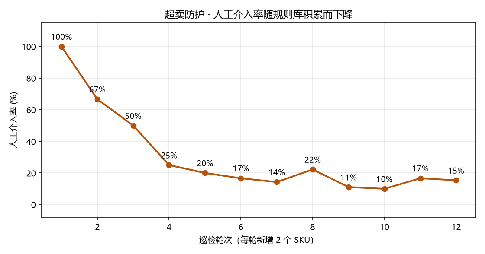
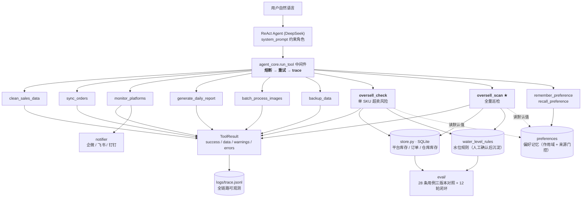

# 电商运营风险防控 Agent（ecom-ops-agent）

> 面向中小电商 / 贸易公司的运营自动化 Agent：一个 ReAct Agent 挂 **8 个业务工具**，
> 用中文下指令即可完成数据清洗、订单对账、多平台监控、日报生成、图片处理、数据备份，
> 以及 ★ **多平台超卖风险巡检**。

---

## 一、解决什么业务问题

### ① 运营日常：6 类重复动作靠人工 Excel

销售数据清洗、订单与 ERP 对账、多平台库存/价格盯梢、日报汇总、商品图处理、数据备份 ——
每一样都不难，但每天都要做，**而且出错很难发现**。

> **本项目的取舍**：这类"省时间"的价值有限（省下的人力往往抵不上工具成本）。
> 所以真正的主线是下面这件事。

### ② ★ 多平台超卖：一次事故 = 真金白银

一个 SKU 同时在淘宝 / 抖音 / 拼多多 / 京东售卖时，**各平台库存相互独立**：

```
淘宝展示 50 | 抖音展示 40 | 拼多多展示 30 | 京东展示 20   → 四平台合计 140
但仓库里实际只有 80 件
```

更隐蔽的是：**"已付款未发货"的订单已经在占用库存**，
但它既没体现在平台展示库存里（平台已经扣了），也没从仓库里减（还没发货）。

**朴素实现两边都不算，于是"看着还有货，其实早就卖超"。**

代价：

| 损失项 | 说明 |
|---|---|
| 平台赔付 | 订单金额的约 30%（部分平台更高） |
| 差评 / 投诉 | 店铺评分下降 |
| **平台扣分 / 降权** | 流量减少 —— **最贵的一项是长期的** |

---

## 二、核心亮点

- **单 Agent 工具调用架构**：一个 ReAct Agent 挂 8 个业务工具，自然语言即可调度
- **零凭证可运行**：未配置 API Key 时自动进入 mock 模式，用内置示例数据跑通全部工具，开箱即演示
- **★ 超卖检测三阶段评测**：28 条仿真用例（真值写死），检出率 **41% → 100%**，误报 **0 → 4 → 0**
- **★ 闭环：人工介入率 100% → 15%**：人工确认的水位规则沉淀入库，同类 SKU 自动套用
- **★ 三层记忆**：会话 / 偏好（跨会话，带作用域与来源门控）/ 业务规则 —— 见第四节
- **★ 平台插件化**：`plugins/sources/` 一个平台一个文件，**加平台 = 加文件，主流程零改动**。
  插件接口用**三态快照**（正常 / 未上架 / 不可用）而不是 `int|None` ——
  「读不到」绝不写成 0（那会凭空造出展示库存、改变均分基位、污染超卖判定）；
  **单个平台接口抖动被隔离**，其余平台照常同步
- **结构化 ToolResult**：所有工具返回 `success / data / warnings / errors`，业务失败显式可见
- **中间件三件套**：指数退避重试 + 熔断器（5 次失败/30s 恢复）+ 全链路 JSONL trace
- **推送通道适配器**：企业微信 / 飞书 / 钉钉三种 webhook，未配置时自动降级为本地日志
- **离线 eval + baseline 对比**：50 条仿真问句 + 28 条超卖用例，自动产出报告与图表
- **Streamlit 交互演示**：`streamlit run app.py` 零凭证即可在浏览器点击运行

---

## 三、超卖防护模块（主线）

### 数据模型（`store.py`，SQLite）

| 表 | 作用 |
|---|---|
| `platform_inventory` | 各平台展示库存快照 |
| `orders` | 订单（★ 含「已付款未发货」，超卖检测的关键输入） |
| `warehouse_stock` | 仓库实际库存（真值来源） |
| `water_level_rules` | 平台水位规则（**闭环沉淀的资产**） |

### 核心公式（`tools/oversell_tool.py`）

```
可用库存   = 仓库实际库存 − 在途订单占用 − 安全库存
超卖风险量 = 各平台展示库存合计 − 可用库存
```

### 三阶段评测结果

| 版本 | 做法 | 检出率 | 准确率 | 误报 | 漏检 |
|---|---|---:|---:|---:|---:|
| **v0 baseline** | 可售 = 仓库 − 安全库存（**不减在途占用**） | **41%** | 100% | 0 | **10** |
| **v1** | ＋在途占用；平台水位**均分** | **100%** | 81% | **4** | 0 |
| **v2** | ＋平台水位取**规则库** | **100%** | **100%** | **0** | **0** |

> 28 条用例覆盖：在途占用 / 展示即超 / 退款与取消订单 / 已发货占用 / 重复推送（幂等）/ 边界值。
> **真值在造用例时写死** —— 这是"检出率"能成立的前提。
> 复现：`python -m eval.oversell_eval` → `eval/oversell_report.md`

### 闭环：人工介入率随规则库积累下降

```
第 1 轮  100%  →  第 2 轮 67%  →  第 3 轮 50%  →  第 4 轮 25%
        →  ……  →  第 12 轮 15%
```



> 模型：每轮新增 2 个 SKU 上架，巡检「已确认历史 SKU + 新 SKU」。
> 告警中已有水位规则的自动处理，没有的必须人工确认；确认后规则沉淀，下轮转自动。
> 复现：`python -m eval.oversell_loop` → `eval/oversell_loop_report.md`

---

## 四、记忆设计（三层）

系统不是无状态的 —— 记忆分三层，各管一段：

| 层 | 存在哪 | 活多久 | 解决什么 |
|---|---|---|---|
| **① 会话记忆** | Agent 层（`thread_id`） | 一次会话 | 「刚才那个 SKU 再扫一次」 |
| **② 偏好记忆** | `memory.py` → SQLite `preferences` | **跨会话** | 「以后安全库存按 10 算」，不用每次重复交代 |
| **③ 业务记忆** | `store.py` → SQLite `water_level_rules` | 长期 | SKU 级水位规则，跟着商品走 |

### 两个关键设计取舍

**① `scope` 作用域**：`global` / `platform:taobao` / `sku:A001`

> 为什么需要？「安全库存默认 10」和「A001 在淘宝的水位」不是一个粒度。
> 混在同一张无作用域的表里，早晚互相覆盖。

**② `source` 来源**：`user_confirmed` / `inferred`

> 为什么需要？用户明确说的可以直接当默认值；
> **系统自己推断的不能** —— 否则一次误判会被永久固化成"事实"。
> 这就是「记忆污染」的入口，所以在**读取侧**就把闸门设好：
> `recall()` 默认只认 `user_confirmed`。

另外 `remember()` 带 **key 白名单**（`ALLOWED_KEYS`）—— 防止 Agent 往记忆里塞任意字段。

### 实际效果

```python
清空记忆后：     safety_stock = 5          # 项目默认
global = 20 后： A001 → 20 | A002 → 20
sku:A001 = 30：  A001 → 30 | A002 → 20    # SKU 级覆盖 global
```

**作用域优先级：`sku:<sku>` > `global` > 项目默认值**

> 复现：`python memory.py`

### 和三层的呼应

- **偏好记忆**（用户级）：「以后安全库存按 10」—— **一次交代，长期生效**
- **业务记忆**（实体级）：「A001 在淘宝的水位 30%」—— **确认一次，自动复用**

两层都是「人工输入 → 持久化 → 自动应用」，只是粒度不同。

---

## 五、快速开始

```bash
# 1. 安装依赖
pip install -r requirements.txt

# 2. 零凭证直接看演示（推荐先跑这个，含超卖巡检）
python demo.py

# 3. 单元测试
python -m pytest tests/test_tools.py -q

# 4. 原有 eval（baseline + optimized + 对比图 + 报告）
python eval/run_all.py

# 5. ★ 超卖检测三阶段评测
python -m eval.oversell_eval

# 6. ★ 闭环指标（人工介入率曲线）
python -m eval.oversell_loop

# 7. ★ 偏好记忆演示（作用域优先级 + 防记忆污染）
python memory.py

# 8. Streamlit 交互演示（浏览器点击运行，零凭证）
streamlit run app.py

# 9.（可选）配置 DeepSeek 后由大模型智能调度
cp .env.example .env      # 填入 DEEPSEEK_API_KEY
python run.py
```

---

## 六、架构



> 📐 **完整的目录职责、核心运行链路、架构不变量与设计取舍见 [ARCHITECTURE.md](ARCHITECTURE.md)。**
>
> 机制文档：
> [超卖防控与三版本演进](docs/mechanisms/oversell.md) ·
> [评测设计](docs/mechanisms/evaluation.md) ·
> [偏好记忆](docs/mechanisms/memory.md) ·
> [工具中间件](docs/mechanisms/middleware.md) ·
> [优化日志](docs/OPTIMIZATION_LOG.md)

---

## 七、工具与业务场景对应

| 业务场景 | Agent 工具 | 价值 |
|---|---|---|
| 销售数据人工 Excel 清洗 | `clean_sales_data` | 自动去重、补空、标准化金额/日期 |
| SKU ↔ ERP 编码对照 + 同步校验 | `sync_orders` | 输出订单同步对账报告，失败率超阈值显式报错 |
| 多平台库存 / 价格盯梢 | `monitor_platforms` | 检测库存告急 / 价格异常并推送告警 |
| 日报人工汇总 | `generate_daily_report` | 一句话生成并推送 Excel 日报 |
| 商品图人工裁剪 | `batch_process_images` | 批量缩放 + 水印 |
| 数据备份 | `backup_data` | 本地 + 异地（网盘可选） |
| **★ 多平台超卖风险** | `oversell_check` / `oversell_scan` | 可用库存校验，输出缺口与建议水位 |

---

## 八、接入真实系统（接口已留好）

| 能力 | 当前 mock 实现 | 接入真实系统的位置 |
|---|---|---|
| 销售数据 | `data/sales_raw.csv` | 替换为 ERP/数据库导出或 ODBC 取数 |
| 订单同步 | `data/orders.csv` + `sku_erp_mapping.csv` | 对接电商平台 OpenAPI + ERP 接口 |
| 多平台库存 | `data/platforms.csv` | 替换为各平台开放平台 API |
| **超卖检测** | `store.py`（SQLite） | 换成真实库存中心 / 订单中心 |
| 推送通道 | 本地日志 `data/alerts.log` | 配置 `WECHAT_WEBHOOK` / `FEISHU_WEBHOOK` / `DINGTALK_WEBHOOK` 任一即真实推送 |
| 网盘备份 | 仅本地副本 | `BAIDU_NETDISK_ENABLED=true` 启用模拟上传 |

---

## 九、技术栈

`LangChain`（Agent 编排） · `DeepSeek`（LLM） · `SQLite`（业务数据 + 规则库） ·
`pandas`（数据处理） · `openpyxl`（Excel 报表） · `Pillow`（图片批处理） ·
`loguru`（日志） · `pytest`（测试） · `matplotlib`（eval 图表） · `Streamlit`（交互演示）

## 十、相关文档

- `docs/OPTIMIZATION_LOG.md` — 从 demo 到可观测项目的演进记录（问题 → 改动 → 效果）
- `eval/report.md` — 50 条仿真问句的可量化对比报告
- `eval/oversell_report.md` — ★ 超卖检测三阶段评测报告（28 条用例）
- `eval/oversell_loop_report.md` — ★ 闭环指标（人工介入率曲线）
- `memory.py` — ★ 三层记忆中的「偏好记忆」实现（含作用域 / 来源门控 / 白名单）