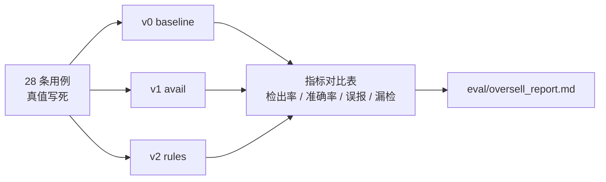

# 评测设计：对照实验与闭环仿真

本项目的评测不是「跑个脚本看看」，而是**对照实验**：三个版本只差一个变量，真值人工写死。

> 实现：`eval/`｜产物：`eval/oversell_report.md`、`eval/oversell_loop_report.md`、`docs/assets/oversell_loop.png`

---

## 为什么评测要这么设计

只说「我的方案准确率 100%」是**没有说服力的**。有说服力的是：

> 它比**什么**好、好了**多少**、代价是**什么**。

所以要有一个 baseline（业界直觉做法），要有对照组，要有可归因的变量。

---

## 一、评测集：28 条用例，真值人工写死

`eval/oversell_cases.py` —— **17 条有风险 / 11 条安全**。

```python
{
    "id": "R01",
    "desc": "在途占大头（v0 漏检）",
    "ground_truth": {"risky": True, ...},
    ...
}
```

**「真值人工写死」是这个评测能成立的前提。**
如果用模型标注真值，就变成了「用模型评模型」—— 模型的偏差会被当成正确答案，
评测结果不再反映真实质量。用例里每条的 `desc` 就是标注时的判断依据。

用例覆盖的关键场景：

| 类别 | 例子 |
|---|---|
| 安全（11 条） | 均匀分布无规则、淘宝独占已确认 85%、有在途但四平台已确认水位、**退款订单不占库存**、**取消订单不占库存**、**同一订单重复推送·幂等**、全部已发货、展示刚好等于可用（边界）、超宽松水位 |
| 风险（17 条） | **在途占大头**、小幅超、在途刚好顶破、展示即超仓库、有规则但仍超、展示比可用多 1（边界）、大额在途、已发货占用、混合状态订单、安全库存为 0 仍超、多平台极端不均、退款后又被买走、仓库为零、在途占一半、在途+展示双重超标 |

边界用例是刻意设计的：**「展示刚好等于可用」和「展示比可用多 1」这一对**
能同时验证「不误报」和「不漏检」两个方向。

---

## 二、三版本对照（`oversell_eval.py`）



**三个版本只差一个变量**：

- v0 → v1：只加了「在途占用」这一项；
- v1 → v2：只把「均分水位」换成「规则库水位」。

这样指标变化**可以归因到具体的那个改动**，而不是「我也不知道为什么变好了」。

| 版本 | 检出率 | 准确率 | 误报 | 漏检 |
|---|---:|---:|---:|---:|
| v0 baseline | 41% | 100% | 0 | 10 |
| v1 avail | 100% | 81% | 4 | 0 |
| v2 rules | 100% | 100% | 0 | 0 |

---

## 三、闭环仿真（`oversell_loop.py`）

静态用例集回答的是「判得准不准」，回答不了「**这套机制长期跑下去人工成本会不会降**」。

所以另做了一个 12 轮闭环：`ROUNDS=12`、`NEW_PER_ROUND=2`，
风险 / 安全用例交错，每轮新增 2 个 SKU 上架。

```python
def _human_confirm(case, available):
    """模拟人工确认水位 —— 这正是「沉淀」的来源。"""
    store.upsert_rule(...)
```

告警中已有水位规则的自动处理，没有的必须人工确认；确认后规则沉淀，下轮转自动。

| 轮次 | 1 | 2 | 3 | 4 | 5 | 6 | 7 | 8 | 9 | 10 | 11 | 12 |
|---|---:|---:|---:|---:|---:|---:|---:|---:|---:|---:|---:|---:|
| 巡检 SKU | 2 | 3 | 5 | 7 | 8 | 9 | 10 | 11 | 13 | 14 | 15 | 17 |
| 人工介入率 | 100% | 67% | 50% | 25% | 20% | 17% | 14% | 22% | 11% | 10% | 17% | **15%** |

**怎么读这条曲线**：

- 整体下降 = 规则沉淀在起作用；
- 中间有反弹（第 8 轮 22%、第 11 轮 17%）= 新 SKU 带来的新场景需要新的确认，
  这是正常的 —— **曲线不是单调下降才真实**；
- 收敛到 15% 而非 0 = 总会有新组合，这部分人工是必要的成本，不是缺陷。

产物：`docs/assets/oversell_loop.png`

---

## 四、Agent 层评测（50 条仿真问句）

另有一套针对 Agent 全链路的评测（`eval/run_all.py`）：
50 条仿真问题分四类（简单 / 多步 / 知识缺失 / 歧义），
对比「无校验 baseline」，指标是工具成功率 / 路由命中率 / 调用正确率。

```bash
python eval/run_all.py     # 一站式：eval + baseline + comparison
```

产物：`last_run.json`、`baseline_run.json`、`comparison.png`、`report.md`

---

## 可复现性

| 命令 | 产物 |
|---|---|
| `python -m eval.oversell_eval` | `eval/oversell_report.md` |
| `python -m eval.oversell_loop` | `eval/oversell_loop_report.md` + PNG |
| `python eval/run_all.py` | `report.md` + `comparison.png` + JSON |

---

## 已知不足

| 不足 | 改进方向 |
|---|---|
| 用例是仿真数据，不是真实订单 | 接真实数据（脱敏）扩充用例集 |
| 真值只有二值（risky / safe） | 加风险量级和严重度分级 |
| 无「用户点踩回流」机制 | 线上收集分歧样本，定期补进评测集 |
| 闭环仿真的「人工确认」是模拟的 | 接真实审批时长，能量化人力成本节省 |
