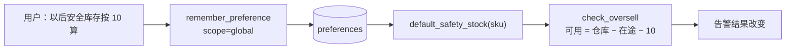

# 偏好记忆与来源门控

跨会话记住用户 / 租户级的设置，让「以后安全库存按 10 算」这句话只说一次。

> 实现：`memory.py`｜存储：`ops.db` 的 `preferences` 表

---

## 为什么需要这一层

原实现是**无状态**的 —— 每次对话都从零开始。
用户说「以后安全库存统一按 10 算」，下次它还是用 5，得再说一遍。

---

## 三层记忆的分工

| 层 | 内容 | 生命周期 | 存储 |
|---|---|---|---|
| **会话记忆** | 对话上下文 | 本次会话 | Agent 层（thread） |
| **偏好记忆** | 用户 / 租户级设置 | **跨会话长期有效** | `preferences` 表 ← 本模块 |
| **业务记忆** | 实体级规则（跟着 SKU 走） | 长期 | `water_level_rules` 表 |

「安全库存默认 10」和「A001 在淘宝的水位是 85%」**不是一个粒度**，
混在一张无作用域的表里早晚会互相覆盖。

---

## 两个关键设计取舍

### ① scope 作用域

`global` / `platform:taobao` / `sku:A001`

读取时按优先级解析（`resolve`）：**精确作用域 → global → 项目默认值**。

```python
def default_safety_stock(sku=None) -> int:
    """作用域优先级：sku:<sku> > global > 项目默认 5"""
    scopes = (f"sku:{sku}",) if sku else ()
    return int(resolve("default_safety_stock", 5, extra_scopes=scopes))
```

### ② source 来源门控

- `user_confirmed` —— 用户明确说的，可以直接当默认值用；
- `inferred` —— 系统自己推断的，**默认不作为默认值使用**。

```python
def recall(scope, key, default=None, allow_inferred=False):
    """★ 默认只认 user_confirmed —— 系统推断出来的值不作为默认值使用，
       避免一次误判被固化成「事实」。"""
    if row["source"] == SOURCE_INFERRED and not allow_inferred:
        return default
```

**这就是「记忆污染」的入口**，所以在**读取侧**就把闸门设好，而不只是在写入侧。

---

## 白名单：防任意字段入库

`ALLOWED_KEYS`：

| key | 含义 |
|---|---|
| `default_safety_stock` | 安全库存默认值 |
| `alert_channel` | 告警推送通道（wecom / feishu / dingtalk） |
| `active_platforms` | 在售平台列表 |
| `default_rules_enabled` | 是否默认套用水位规则库 |

不在白名单里的 key 直接 `raise KeyError`（**显式失败**，不是静默忽略）。

---

## Agent 工具入口

| 工具 | 说明 |
|---|---|
| `remember_preference(key, value, scope)` | 记住一条设置，下次自动生效 |
| `recall_preference(key, scope)` | 读回设置 |

LLM 传进来的参数都是字符串，`_coerce()` 负责把 JSON 形态的字符串还原成原始类型
（`'["taobao","douyin"]'` → `["taobao","douyin"]`）。

---

## 与超卖逻辑的衔接

`tools/oversell_tool.check_oversell` 在 `safety_stock` 为 `None` 时调用
`memory.default_safety_stock(sku)` —— 于是「用户设过的默认值」直接影响检测结果。

这是一条**从记忆到业务判定**的真实链路，不是摆设：



---

## 已知不足

| 不足 | 改进方向 |
|---|---|
| 无 TTL / 过期 | 支持按 key 配有效期 |
| 无写入前语义去重 | 同一设置换个说法会各存一份 |
| 无变更审计 | 加 who / when / 旧值 记录 |
| 无界面管理 | `app.py` 加「我的设置」页 |
