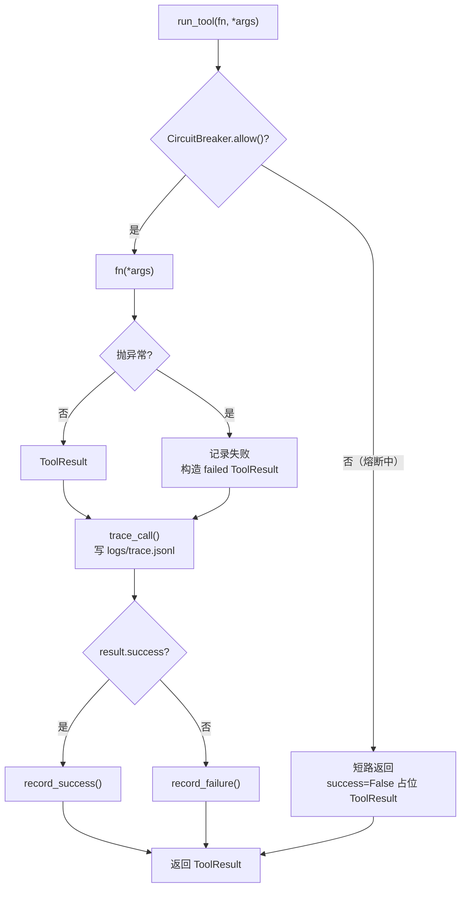

# 工具中间件：熔断 / 校验 / Trace

所有工具调用统一走 `agent_core.run_tool()`，业务工具只关心自己的纯逻辑，
可靠性能力由中间件统一提供。

> 实现：`agent_core.py` + `tools/retry.py` + `tools/validators.py` + `tools/trace.py`

---

## 一条调用链



**为什么把这三件事放在一起**：它们都作用于「一次外部调用」这个边界，
而且都需要「调用前预判 + 调用后记账」。分散到每个工具里写，一定会漂移 ——
有的工具记 trace，有的不记；有的工具熔断，有的不熔断。

---

## ① 熔断器（`tools/retry.py`）

三态状态机：

| 状态 | 行为 |
|---|---|
| **关闭**（正常） | 放行，成功清零失败计数，失败累加 |
| **打开**（熔断） | 连续失败 ≥ `threshold`（默认 5）→ 打开，之后 `reset_seconds`（默认 30s）内**所有调用短路**，不去打下游 |
| **半开**（探测） | 30s 后放一个请求试，成功关闭，失败继续打开 |

**为什么需要**：下游挂了的时候，「失败就重试」反而会**雪上加霜** ——
大量请求持续打已经挂掉的服务会让它更起不来（雪崩）。
熔断是**主动放弃一段时间**，给下游恢复的机会。

**和重试的分工**：

- `retry_with_backoff` 治**偶发抖动** —— 网络闪一下、API 超时一次；
- `CircuitBreaker` 治**持续故障** —— 下游已挂，重试一万次也没用。

两个都要有。指数退避参数：`max_retries=3`、`initial_delay=0.5`、`backoff_factor=2.0`。

状态暴露到 `app.py` 侧边栏（`breaker_status()`），演示时能实时看到失败计数与是否熔断。

---

## ② 结构化返回与校验（`tools/validators.py`）

```python
@dataclass
class ToolResult:
    success: bool              # 主流程是否完成
    data: dict                 # 结构化业务数据
    warnings: list[str]        # 非致命异常（部分 SKU 缺失等）
    errors: list[str]          # 致命错误
    summary: str               # 人类可读总结（向前兼容原 str 风格）
```

**设计动机（来自真实复盘）**：

| 原来的问题 | 现在 |
|---|---|
| 所有工具返回长字符串 | 结构化字段，`to_text()` 向后兼容 |
| 部分失败只能整段失败 | `warnings` 与 `errors` 分离 |
| 运行到一半才发现字段缺失 | `validate_tool` 装饰器提前校验 |
| 阈值告警混在文本里，解析困难 | 独立 `warnings` 列表 |

`validate_tool(schema, required_data_keys)` 装饰器：

- `required_data_keys` —— 必现字段缺失则记 error 并 `success=False`；
- `schema` —— 字段级校验函数。

**「防止工具谎报成功」**：`file_exists` / `dir_exists` 校验器会去磁盘上确认
工具声称的输出文件真的存在。模型可以声称「已生成报告」，但只有文件系统能作证。

---

## ③ Trace（`tools/trace.py`）

每次调用写一行 JSONL 到 `logs/trace.jsonl`：

```json
{"ts": 1758888888.123, "tool": "oversell_scan", "args": [], "kwargs": {},
 "duration_ms": 12.4, "success": true, "result_summary": "发现 3 个 SKU 存在超卖风险…"}
```

- `_safe()` 做 JSON 序列化兜底（ToolResult / 异常 / 集合 → dict / str）；
- `summarize_traces()` 输出按工具分组的：调用次数、成功率、平均耗时；
- `app.py` 的「全链路 Trace」面板直接读它 —— **问题排查不再靠 print**。

**为什么用 JSONL 而不是日志**：一行一条、可流式追加、可用 `jq` 直接查询、
不需要引入任何可观测性组件。代价是没有分布式追踪 —— 单机项目不需要。

---

## 与项目 1 的对比

| 项目 | 中间件形态 |
|---|---|
| **multi-agent-system** | `harness.guarded_tool`：超时 + 有限重试 + 耗时日志 |
| **ecom-ops-agent** | `run_tool()`：熔断 + 返回结构校验 + JSONL trace |

两者是**不同取舍**：前者强调「超时必须有界」（并踩过 `with ThreadPoolExecutor` 的坑），
后者强调「失败可观测」。共同的思路是：**横切关注点集中在中间件，业务工具只写纯逻辑**。

---

## 已知不足

| 不足 | 改进方向 |
|---|---|
| 熔断器是进程内单例，多实例各算各的 | 状态放 Redis |
| 无按工具的独立熔断阈值 | 按工具配置 threshold / reset_seconds |
| trace 无采样与轮转，会一直增长 | 加滚动与保留期 |
| 无耗时分布（P95/P99） | 从 JSONL 聚合分位数 |
