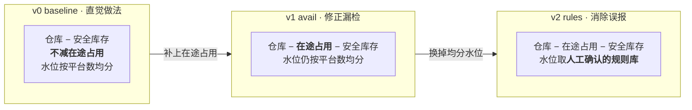
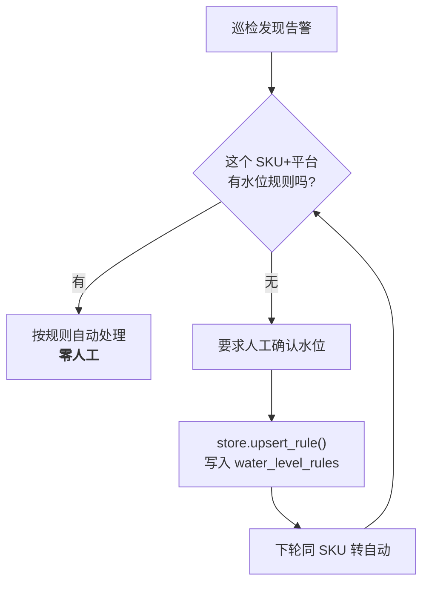

# 超卖防控与三版本演进

多平台卖家最容易亏钱的场景之一：**同一批货在多个平台同时超卖**。
本模块用「可用库存」判定风险，并通过三版本对照实验证明每一步改进的收益。

> 实现：`tools/oversell_tool.py` + `store.py`｜评测：`eval/`

---

## 业务问题

一个 SKU 的货放在仓库里，同时在淘宝、抖音、拼多多、天猫多个平台上架。
每个平台有自己的「展示库存」。风险是：

**各平台展示库存之和 > 实际可卖的货 → 超卖。**

肉眼看仓库还有货 ≠ 能卖 —— 因为已经有「已付款但未发货」的订单占着库存了。

---

## 核心公式

```
可用库存 = 仓库库存 − 在途占用 − 安全库存
```

| 项 | 来源 | 说明 |
|---|---|---|
| 仓库库存 | `store.get_warehouse_stock(sku)` | 物理库存 |
| **在途占用** | `store.in_transit_qty(sku)` | 只算 `paid` / `shipped` 状态的订单 |
| 安全库存 | `memory.default_safety_stock(sku)` | 作用域优先级：`sku:X` > `global` > 默认 5 |

**「在途占用」是整件事的关键**：
只按「各平台展示合计 vs 仓库库存」判断，会漏掉这一项 —— 这就是 v0 的缺陷。

---

## 三版本演进（只差一个变量）



| 版本 | 函数 | 说明 | 检出率 | 准确率 | 误报 | 漏检 |
|---|---|---|---:|---:|---:|---:|
| v0 | `check_oversell_naive` | 不减在途占用 | 41% | 100% | 0 | **10** |
| v1 | `check_oversell(use_rules=False)` | 加在途占用，水位均分 | 100% | 81% | **4** | 0 |
| v2 | `check_oversell(use_rules=True)` | 水位取规则库 | **100%** | **100%** | 0 | 0 |

> 28 条用例（17 条有风险 / 11 条安全），真值在造用例时写死。可复现：`python -m eval.oversell_eval`

### 每一步在解决什么

**v0 → v1：修的是「漏检」。**
v0 只要「展示合计没超过仓库」就判安全。但没算「已付款未发货」的占用 ——
业务上就是**「看着还有货，其实早就卖超了」**。这是最危险的错误方向：
该报警的时候不报，损失是真金白银。

**v1 → v2：修的是「误报」。**
v1 没有规则时只能按平台数**均分**水位。但现实中各平台本来就不均 ——
某个平台是主战场（比如淘宝占 85%），均分就会误报。
v2 的水位来自**人工确认后沉淀的业务事实**，而不是拍脑袋均分。

**结论**：检出率和准确率是两个方向的错，不能用同一个手段同时解决。
v1 靠公式修正，v2 靠业务知识 —— 前者是算法，后者是领域数据。

---

## 风险分级

`_level(risk_qty, available)` 输出三档：绿 / 黄 / 红。
配合 `monitor_tool` 的告警推送（`notifier.notify`）。

---

## 规则沉淀（闭环的关键）



规则表 `water_level_rules` 带 `hit_count`（`touch_rule`），能看出规则是否真的在起作用。

**12 轮闭环仿真**（`python -m eval.oversell_loop`，每轮新增 2 个 SKU）：

| 轮次 | 1 | 3 | 5 | 8 | 12 |
|---|---:|---:|---:|---:|---:|
| 人工介入率 | 100% | 50% | 20% | 22% | **15%** |

**这个指标的意义**：证明「规则沉淀机制真的在减少人工」，而不是只看准确率。
准确率 100% 但每次都问人，业务上是没价值的。

---

## 对外工具

| 工具 | 作用 |
|---|---|
| `oversell_check(sku, safety_stock)` | 单个 SKU 的超卖风险检查 |
| `oversell_scan(safety_stock)` | 全量巡检，列出所有有风险的 SKU 与总缺口 |
| `oversell_scan_demo()` | 演示入口：先写演示数据再巡检（供 app.py / demo.py 零参数调用） |

---

## 已知不足

| 不足 | 改进方向 |
|---|---|
| 数据是本地 SQLite 仿真数据 | 接真实平台 API / ERP 只读视图 |
| 平台接入是硬编码字段 | 抽成 `platforms/` 插件，加平台不改核心 |
| 无并发下单调货 | 真实场景需要分布式锁或库存预占 |
| 水位规则只有精确匹配 | 支持按品类 / 价格带继承默认水位 |
